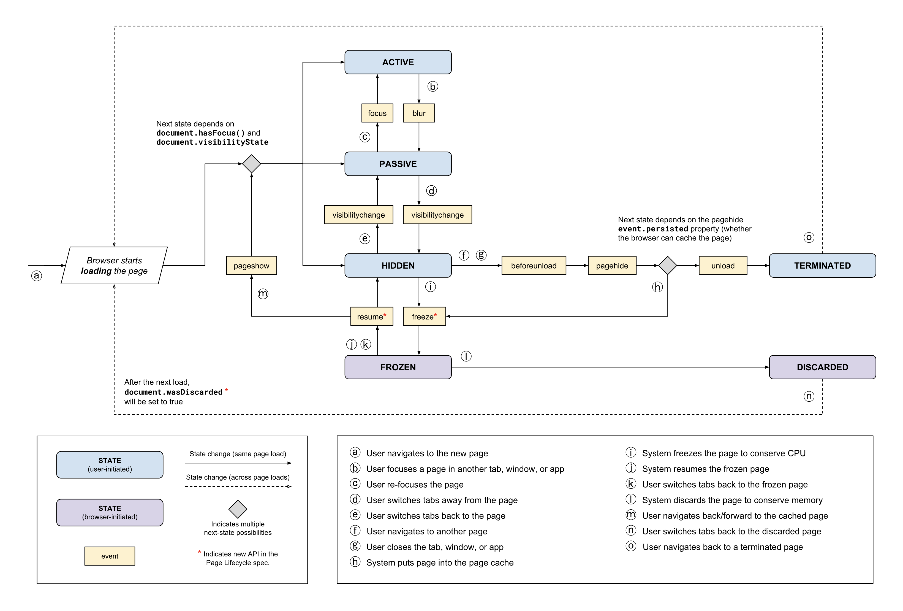

#### 页面的生命周期：

1. 页面生命周期事件：

   - DomContentLoaded -- 浏览器已完全加载完 Html,并构建完 Dom 树；并且所有 deferred scripts 脚本加载并执行完就触发；不会等待 async scripts，子 iframe,样式表，图片等资源加载完成；
     但是 deferred scripts 会等待样式表加载完成，所以在有 deferred scripts 的文档中，DomContentLoaded 还是会在样式表加载后；

   ```
   The DOMContentLoaded event fires when the HTML document has been completely parsed, and all deferred scripts (<script defer src="…"> and <script type="module">) have downloaded and executed. It doesn't wait for other things like images, subframes, and async scripts to finish loading.
   DOMContentLoaded does not wait for stylesheets to load, however deferred scripts do wait for stylesheets, and DOMContentLoaded queues behind deferred scripts. Also, scripts which aren't deferred or async (e.g. <script>) will wait for already-parsed stylesheets to load.
   ```

   - load -- 浏览器加载完所有资源才会触发；

   ```
   The load event is fired when the whole page has loaded, including all dependent resources such as stylesheets and images. This is in contrast to DOMContentLoaded, which is fired as soon as the page DOM has been loaded, without waiting for resources to finish loading.
   ```

   - beforeUnload -- 用户即将离开该页面发起（包括刷新页面）；可以用来检查和确认是否要离开该页面；但是监听中调用 window.alert(), window.confirm(), and window.prompt()方法可能会被忽视；

   - unload -- 文档或资源已经被卸载；可以用来最后的一些数据记录；

2. 其他监听页面加载的方法- Document.readyState
   The Document.readyState property describes the loading state of the document.

   可以利用 document.onreadystatechange 监听状态改变；
   具体状态值：

   - loading: 文档还在加载：The document is still loading.
   - interactive: 文档已经被加载完成，并且已经解析完成；但是资源并没有被加载完成；---The document has finished loading and the document has been parsed but sub-resources such as scripts, images, stylesheets and frames are still loading.
     !!! **[ 该事件会在 DomContentLoaded 事件前触发；]**
   - complete: 文档包括资源都已经加载完成；The document and all sub-resources have finished loading. The state indicates that the load event is about to fire.
     !!! **[该事件会在 window.load 事件前触发；]**

3. 页面生命周期状态
   
   - Active --活动状态：如果页面可见并且具有输入焦点，则该页面处于活动状态；
   - Passive --被动状态：如果页面可见且没有输入焦点，则页面处于被动状态；
   - Hidden --隐藏状态：如果页面不可见且未被冻结，则页面处于隐藏状态；
   - Frozen --冻结状态： 在冻结状态下，浏览器暂停页面任务队列中可冻结任务的执行，直到页面解冻。这意味着 JavaScript 计时器和 fetch 回调之类的东西不会运行。已经运行的任务可以完成（最重要的是冻结回调），但它们可能会受限于它们可以做什么以及它们可以运行多长时间。
     浏览器冻结页面以保留 CPU/电池/数据使用；他们还这样做是为了实现更快的后退/前进导航——避免重新加载整个页面的需要；
   - Discarded --丢弃状态：页面在被浏览器卸载时处于丢弃状态，以节省资源。任何任务、事件回调或任何类型的 JavaScript 都不能在此状态下运行，因为丢弃通常发生在资源限制下，无法启动新进程。在丢弃状态下，即使页面消失，用户通常也可以看到标签本身（包括标签标题和 favicon）
   - Terminated -- 终止状态：一旦页面开始被浏览器卸载并从内存中清除，页面就处于终止状态。在这种状态下没有新的任务可以启动，并且正在进行的任务如果运行时间过长可能会被杀死；

参考：

> DomContentLoaded: https://developer.mozilla.org/en-US/docs/Web/API/Window/DOMContentLoaded_event

> load https://developer.mozilla.org/en-US/docs/Web/API/Window/load_event

> beforeunload https://developer.mozilla.org/zh-CN/docs/Web/API/Window/beforeunload_event

> unload https://developer.mozilla.org/en-US/docs/Web/API/Window/unload_event

> Document.readyState https://developer.mozilla.org/en-US/docs/Web/API/Document/readyState

> Page Lifecycle API https://developer.chrome.com/blog/page-lifecycle-api/
